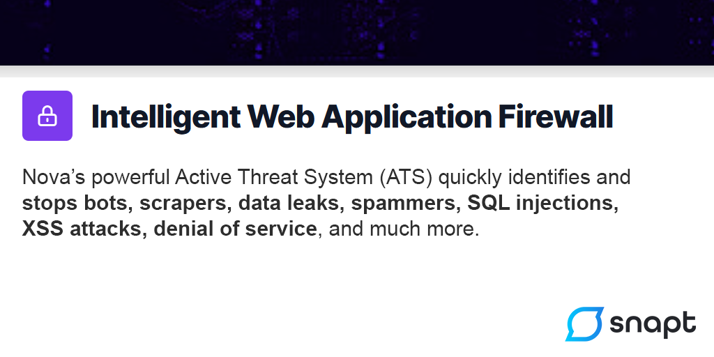

# Traefik Nova Plugin

Traefik plugin to proxy requests to Snapt Nova for evaluation against the WAF. 

## What does Nova WAF provide you?

Nova is a powerful Layer 7 WAF/WAAP.

Nova's powerful Active Threat System (ATS) quickly identifies and stops bots, scrapers, data leaks, spammers, SQL injections, XSS attacks, denial of service, and much more.

#### Layer 7 WAF

Nova provides a full OWASP 10 protection suite, ensuring your site and apps are PCI compliant and protected from threats, denial of service and abuse.

#### Central Security Orchestration

Centrally manage, deploy and control blacklists, whitelists, rulesets, rate limits and more across all your ADCs (multiple clouds / locations).

#### DoS Protection

Nova automatically mitigates Denial of Service attacks, with AI and ML-driven dynamic adjustments to traffic based on real-time telemetry.

#### Total Visibility

Nova web app firewalls are in constant communication with the Nova Cloud Controller, allowing detailed real-time monitoring and reactions to threats. You can easily monitor threats across multiple clouds, datacenters, and locations.

#### Powerful Telemetry

More than just TCP data, Nova monitors request rates, HTTP error rates, HTTP POSTs, known vulnerable endpoints, response codes, IP threat level and much more to determine the likelihood of a threat in real time.

#### Machine Learning and AI

Nova's ML engine profiles your ADCs and the servers behind them, constructing a pattern of "normal" behavior to identify anomalies. Nova's powerful Active Threat System (ATS) quickly identifies and stops attackers.

## Usage (Kubernetes)

Coming soon.

## Usage (docker-compose.yml)

We have included a docker-compose.yml file primarily for testing purposes. Typically, 
Nova is deployed in a Kubernetes environment with Traefik.

See [docker-compose.yml](docker-compose.yml) for configuration.

1. Set up a Nova Traefik ADC with WAF enabled at https://nova.snapt.net
2. Get the AutoJoin key from https://nova.snapt.net/adcs/auto-join/keys
3. Configure your docker-compose.yml or set your environment variables
4. docker-compose up
5. Go to http://localhost:8000/website, you see your request details
6. Go to http://localhost:8000/website?test=/etc/passwd, the request is blocked if Nova's WAF is enabled

## How it works

This adds a middleware plugin to Traefik which proxies requests to a Nova container before 
sending them to your backend. If Nova determines the request should be blocked 
then it returns a block, otherwise it allows Traefik to continue as it would have.

This requires an AutoJoin key from a Traefik-based ADC you have already added 
on Nova (https://nova.snapt.net) and, naturally, requires that you enable the 
WAF. You can use learning mode on Nova to see what would be blocked. 

